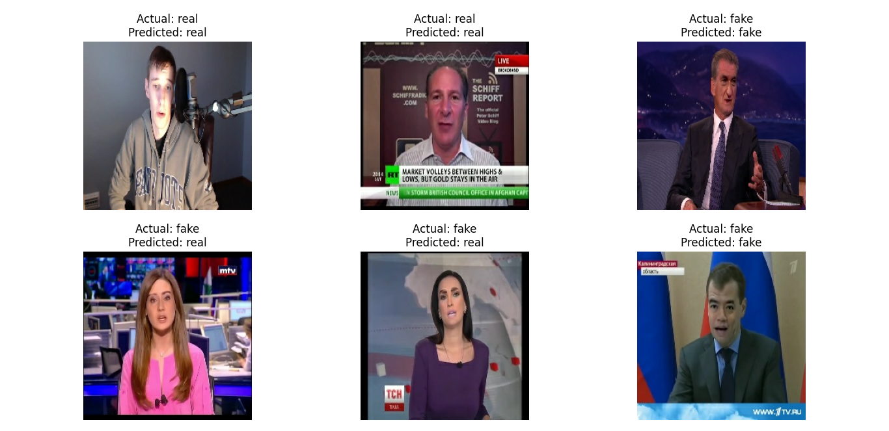
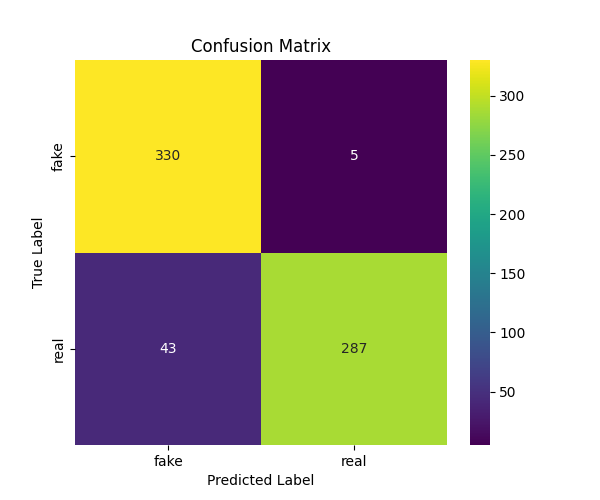

# Deepfake Detection using MobileNetV2

## Project Description
This project uses MobileNetV2 to detect deepfake images by classifying them as real or fake. Video frames are extracted using OpenCV and processed through preprocessing steps like resizing and normalization before training the model.

## Dataset
FaceForensics++ dataset was used for training and evaluation.

## Methodology
- Frame extraction from videos using OpenCV  
- Image preprocessing (resizing to 224×224, normalization)  
- Transfer learning using MobileNetV2  
- Binary classification (real vs fake images)  

## Results
- Achieved accuracy of 88–89%  
- Model performs well on the given dataset  

## Installation and Execution
```bash
pip install -r requirements.txt
python train_cnn.py
```
## Output Samples

### Predictions

- Example predictions showing real vs fake classification
  
### Confusion Matrix

